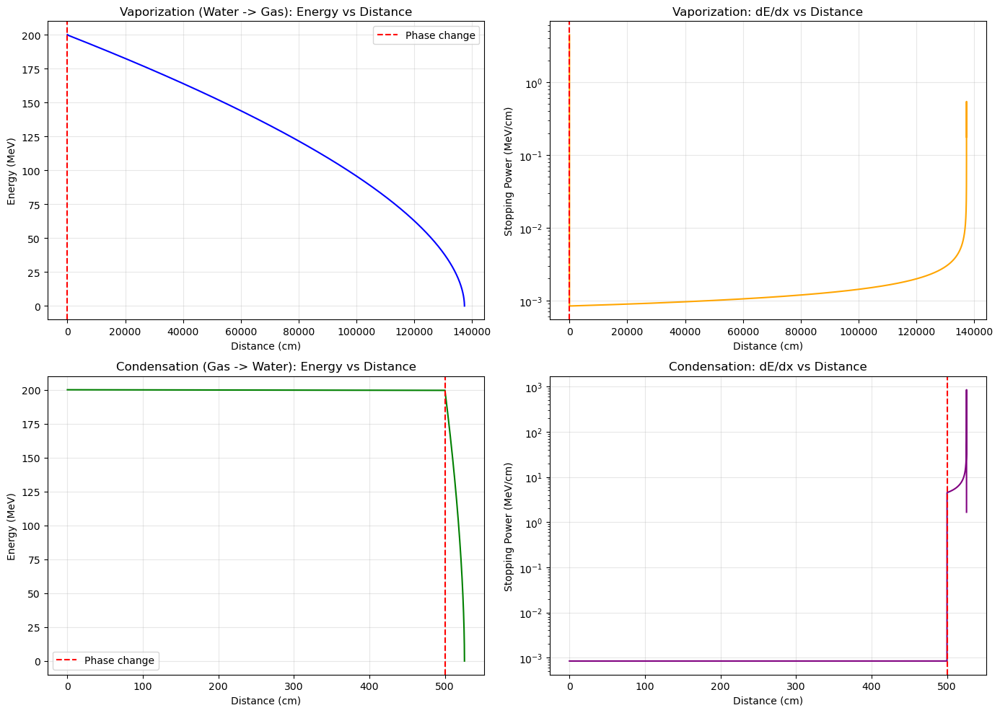

# Bethe-Bloch Energy Loss Simulation (Protons & Alphas)

## ⚛️ Project Overview

This project simulates the energy loss of heavy charged particles (Protons and Alpha particles) as they traverse through different media (Water and Hydrogen Gas). The physics engine uses the **Bethe-Bloch Formula** with relativistic corrections to calculate Stopping Power ($-\frac{dE}{dx}$) and range.

A unique feature of this simulation is the **Phase Change Analysis**, which models the sudden change in material density and ionization potential (e.g., Water $\leftrightarrow$ Gas) and observes its drastic effect on energy deposition.

### 🔬 Physics & Methodology
* **Formula:** Relativistic Bethe-Bloch equation.
* **Particles:** Protons ($0.01 - 1000$ MeV) and Alpha Particles ($0.2 - 400$ MeV).
* **Media:** Water ($H_2O$, $\rho=1.0$ g/cm$^3$) and Hydrogen Gas ($H_2$, $\rho \approx 9 \times 10^{-5}$ g/cm$^3$).
* **Simulation Technique:** Adaptive step-size integration to handle the Bragg Peak and phase transition boundaries precisely.

---

## 📊 Visuals & Results

The simulation demonstrates how a phase change (Vaporization or Condensation) instantly alters the stopping power. The graph below shows the energy loss profile and the sudden jump in Stopping Power ($dE/dx$) at the phase boundary.

**Key Findings:**
* **Vaporization:** Stopping power drops by orders of magnitude; the particle travels much further.
* **Condensation:** Stopping power spikes instantly; the particle stops almost immediately after entering the liquid phase.

---

## 📂 Project Structure

    bethe-bloch-energy-loss/
    ├── bethe-bloch-energy-loss.pdf              # Detailed project report
    ├── fig1_phase_change.png  # Phase change analysis graph
    ├── src/
    │   └── bethe_solver.py    # Main simulation code
    ├── requirements.txt       # Python dependencies
    └── README.md

---

## 🚀 How to Run

### Prerequisites
    pip install -r requirements.txt

### Running the Simulation
    python src/bethe_solver.py

This script will run the phase change simulations and save the result graph (`fig1_phase_change.png`) to the main directory.

---

## 👨‍💻 Author

**Emre Sakarya**
* Hacettepe University, Department of Nuclear Engineering
* Project: NEM 294 Engineering Project II

---

*For detailed physics equations and derivations, please refer to the [Project Report](https://github.com/EmreSakarya/bethe-bloch-analysis/blob/main/bethe-bloch-energy-loss.pdf).*
